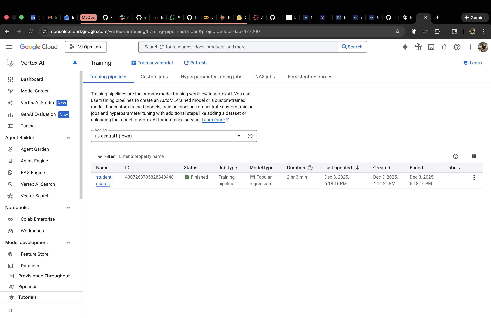
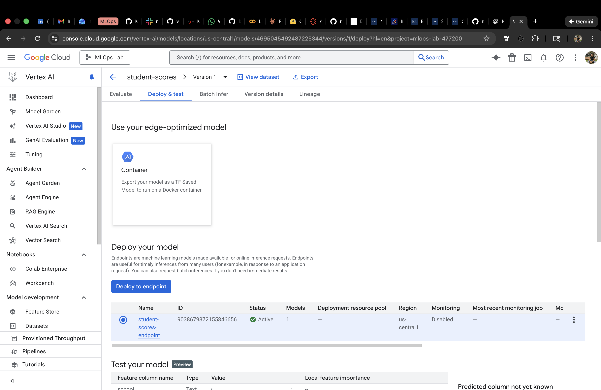
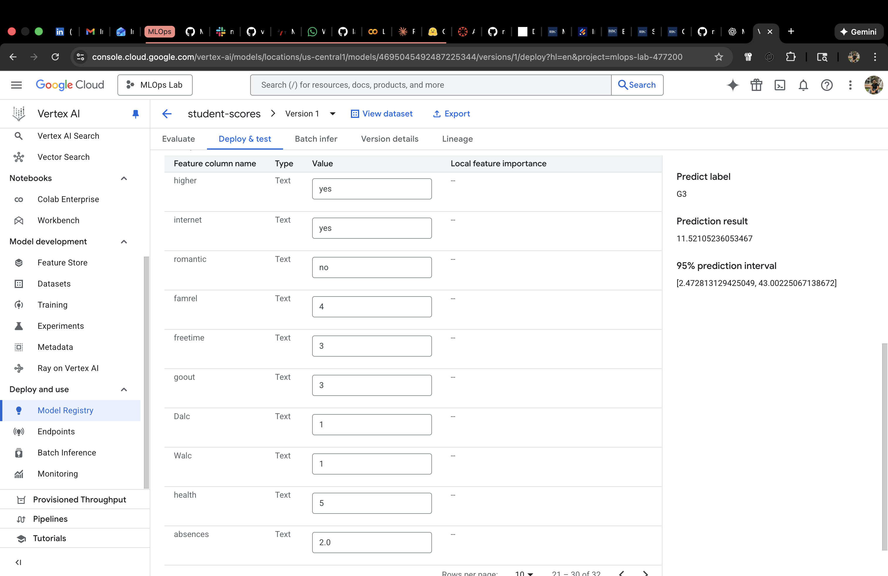

# Student Performance Prediction using Vertex AI AutoML

This lab walks through building, training, deploying, and testing an AutoML Tabular Regression model on Google Cloud Vertex AI. The goal is to predict a student’s final grade (G3) using the Student Performance dataset.

All steps were completed using the Google Cloud console, and all screenshots are stored in the `assets/` folder.

---

## 1. Dataset Used

For this lab I used the **Student Performance** dataset from UCI, which is available as:

- `student-mat.csv` (Math course)
- `student-por.csv` (Portuguese course)

The files contain **33 features** describing:

- Student demographics  
- Family background  
- Study time, absences, lifestyle  
- Parental education and job  
- Past grades (G1, G2)  
- School support programs  

Each file has fewer than 1000 rows, and AutoML Tabular requires at least **1000 rows**.

### ✔ To meet this requirement, I merged both datasets  
This produced:

- **student-merged.csv**
- **1044 total rows**
- **32 input features**
- **Target feature:** `G3` (final grade)

This merged CSV was uploaded to a GCS bucket and imported into Vertex AI as a Tabular Dataset.

---

## 2. Training the AutoML Model

I created a training pipeline in Vertex AI with:

- **Objective:** Regression  
- **Target column:** `G3`  
- **Optimization metric:** RMSE  
- **Training budget:** 1 node hour  
- **Data split:** 80/10/10 (auto)

Training completed successfully.

### Training Pipeline Screenshot  

---

## 3. Deploying the Model

After training, I deployed the model version to a new online endpoint with:

- **Machine type:** n1-standard-2  
- **Min nodes:** 1  
- **Traffic split:** 100 percent  
- **Model monitoring:** Disabled (not required for this lab)

The endpoint became active and ready for inference.

### Endpoint Screenshot  

---

## 4. Testing the Model (Online Prediction)

Prediction was tested using the built-in **“Test your model”** panel in the Vertex AI console.  
All 32 feature values were manually entered, and the deployed endpoint returned the prediction.

### **Prediction Output:**

- **Predicted label:** `G3`
- **Prediction result:** `11.52`
- **95 percent prediction interval:** `[2.47, 43.00]`

### Prediction Screenshot  

---

## 5. Understanding the Prediction

The model predicted:

### ⭐ Final Grade (G3) ≈ **11.5 out of 20**

This is the expected final exam score based on:

- Prior grades (G1, G2)  
- Study time  
- Absences  
- Family support  
- Internet access  
- Other behavioral factors  

The prediction interval is wide because the dataset contains many lifestyle and behavioral variables, which naturally increase variability.

---

## 6. Summary of Completed Steps

✔ Merged two datasets into a single training file  
✔ Uploaded dataset to GCS  
✔ Created a Vertex AI Tabular dataset  
✔ Trained a regression model using AutoML  
✔ Deployed the model to an online endpoint  
✔ Performed real-time prediction using the console  
✔ Captured all screenshots for documentation  

This completes **Lab 6** for Vertex AI AutoML.

---
